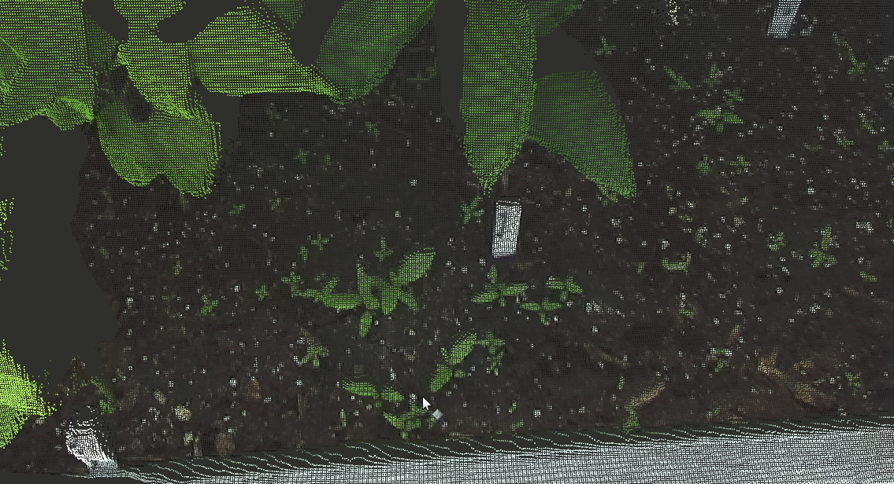

# Plant Selector
This package is meant for creating goal gripper poses for Val in the garden.

This package was made by Miguel Munoz and Christian Foreman. Miguel worked mainly with the weed/branch fitting, and Christian worked with created the rviz plugins and connecting with code with Val. Email cjforema@umich.edu for any questions. If you have any questions about changing the rviz plugins, I can definitely help. Since Miguel and I were the main users, we got pretty familiar with how it all works, but there are probably some things to change to make it easier to use.

## Requirements
Below are requirements for this code to work. In Short, make sure that your ZED camera works in neural mode, and you have the basic ARMLAB packages for controlling the robots.
If you are not using a robot, ZED should be all you need.

### ZED SDK
Since this project assumes the use of a zed camera, it is neccesary to install the ZED SDK.

Follow the download instructions at https://www.stereolabs.com/docs/ros/

You are going to want to make sure you have ZED Neural Mode for optimal performance. You can
check if neural mode is working by running: 
```
ZED_Diagnostic -ais 8
```
This command should notify you of other dependencies such as TensorRT and it may even install these for you.

To check if the zed is working, try running:
```
roslaunch zed_wrapper zed2i.launch
rosrun rviz rviz
# Create a PointCloud2 object whose topic is /zed2i/zed_node/point_cloud/cloud_registered
# You should be able to see points!
```

### ZED2i Parameters
Whenever you run a zed camera with the current roslaunch files, they will be using the current best parameters which are found in
cam_params. The most import parameters here are setting quality to 4 (neural mode), and resolution to 0 (HD2K).

Those should be all the parameters you need. Running some of the launch files may result in complaing about frame rates, so you may want to tweak some parameters for smoother performance. However, you almost always want to run neural mode. The other quality settings result in really poor looking point clouds which aren't nearly good enough for detecting weeds.

Note: all this code was made assuming the ZED2i camera is being used, a different ZED would most likely work as long as you modify the roslaunch files. Using a different camera like realsense could work, but more modifications to the code would be necessary.

### Other Packages
This project also requires other packages such as arm_robots, hdt_michigan, gazebo_ros, and other basic packages for when you are using a robot like Val or Victor.

## Running
Once you have pulled this repo into catkin_ws/src/ make sure to catkin build. After building, things should work. Look below at some example launch files.

Looking in the launch folder, you can see many launch scripts. All of these launch files have rviz files associated with them on launch.

### zed_offline.launch
This is the most basic launch file. In order for this to work as intended, you should have a rosbag file that was recorded from a zed camera. Look in the rosbag panel section for details on how to select the 
rosbag and recording a rosbag with a zed.

To Run:
```
roslaunch plant_selector zed_offline.launch
```



### zed_online.launch
This launch file is the next most basic launch. It will open up rviz, start the zed camera, and run all the necessary scripts. Instead of needing to select a rosbag, like in zed_offline.launch, you can just
select from the live camera feed.

To Run:
```
roslaunch plant_selector zed_online.launch
```


### val.launch
This launch file is meant to be for live demos with Val. In order for this to work, make sure Val is on, e-stop is not pressed, and everything is connected. This also assumes the urdf file of Val has the zed connected
and has the proper transform.

Once all connections are good, make sure you have the can connection by going into hdt_adroit_driver/scripts/ and running:
```
roscd hdt_adriot_driver/scripts
sudo ./peak_usb
```
This command should connect you to Val, run:
```
ifconfig
```
If you see a can connection, you should almost be good to run Val.

Before Commanding Val, you will want to make sure to have a proper .world file for obstacles. After running the roslaunch command below, make sure to render in the obstacles and make sure they look good for your particular environment. You can change the .world file used by editing val.launch.

One final check. Go into the roslaunch file and make sure gazebo_home_directory is the correct value. The value defaults to "/home/armlab" but should be whatever parent directory .gazebo is in for you.

Once all of the steps above are done, you should be good to run Val. Check the documentation repo in ARMLAB for help debugging. To Run:
```
roslaunch plant_selector val.launch
```


By default, the robot will probably move to an upright position that isn't looking down. I suggest making a new group state for Val in a bent over position. You can do this by:
```
roscd hdt_michigan_moveit/config
vi hdt_michigan.srdf
```
Then, add a group state, for our experiments we had the following:
```
<group_state name="bent" group="both_arms">
    <joint name="joint56" value="0" />
    <joint name="joint57" value="1.1" />
    <joint name="joint41" value="0" />
    <joint name="joint42" value="0" />
    <joint name="joint43" value="0" />
    <joint name="joint44" value="0" />
    <joint name="joint45" value="0" />
    <joint name="joint46" value="0" />
    <joint name="joint47" value="0" />
    <joint name="joint1" value="0" />
    <joint name="joint2" value="0" />
    <joint name="joint3" value="0" />
    <joint name="joint4" value="0" />
    <joint name="joint5" value="0" />
    <joint name="joint6" value="0" />
    <joint name="joint7" value="0" />
</group_state>
```
After doing this, specify the default name for the group state in the roslaunch and, if confident in your collision world, you can set the arg 'return_to_default_automatically' to true. This means Val will move to the default position without confirmation from the user on the plan. Also, in between grasping attempts, Val will move back to the default position as a way to reset and move the grippers out of view of the ZED camera.


### val_repetitive.launch
This launch file is almost identical to the launch file above. The only difference is that after the user selects a weed and verifies the plan, Val will repeatedly attempt to grasp the weed. This is meant to demonstrate the need for visual servoing.

Note: This was only used for weed extraction and making recent demos, make sure to look through the code before running.

The purpose of this launch is demonstrate the need for visual servoing. Although Val thinks it is extremely close to the weed, in reality, Val can be up to few centimeters off. This launch file tries to demonstrate this by positioning the gripper above the weed and repetitively trying to grasp the same weed multiple times. You will see that it is consistently pretty off, showing the need for further correction by visual servoing.

To run:
```
roslaunch plant_selector val_repetitive.launch
```
### victor_sim.launch
This launch file is meant to simulate Victor in an offline setting. This simulation could easily be moved to real-time zed data, but the point of using Victor was to test simulation for Val. So note, this launch file may be buggy.

Since it is a simulation and you don't need to set up the hardware connections, the Victor simulation should be as easier as running the following command:
```
roslaunch plant_selector victor_sim.launch
```


### weed_eval.launch
This launch file is very different than the previous ones. Running weed_eval.launch will evaluate how good a weed prediction model is. In the current case, it is running our weed centroid model. Once you run this launch file, the weed model will be evaluated on around 85 hand picked samples of weeds from the garden.

To Run:
```
roslaunch plant_selector weed_eval.launch
```

After running the launch file, the terminal should show useful metrics of the weed model as shown below:


In rviz you should be able to see a weed sample with it's labeled stem center (red) and the prediction from the model (white). Press enter in the terminal to toggle through different weed samples.


To configure this code to work on a different weed prediction model, go into the eval.py file and change the function that is passed into the WeedMetrics object. In order for this to work as easily as possible, your prediction model should return an x y z numpy array of where it thinks the weed stem is. Also, make sure to return the normal of the plane of the dirt. While this isn't extremely necessary, it really helps the visualization when toggling through weeds as eval.py will rotate the pointcloud to make sure all weeds are oriented in the same way.

In order to add more weed data, take a look at scripts/weed_data_collector.py. It's a little clunky in how it works, but basically, it assumes you first select a region of the entire point cloud in which you want to model a weed, followed by a selection of a single point. You can keep going back and forth through this process until you have a good amount of data. Make sure to be using the publishing selector.

## Code Explanation
Below is a quick description of how the current plant fitting models work, most relevant code is found in plant_modeling.py.

### Weed Extraction
After making a selection around a weed, the following steps take place:
1. Filter the pointcloud with a green color filter
2. Filter out small groupings of green points
3. DBSCAN on the remaining green points to cluster groups of green pixels
4. Pick the largest green cluster and we treat that as the weed
5. Get the centroid of the cluster, this acts as a prediction of where the stem is
6. Use the points that aren't green, aka dirt, and fit a plane to the points with RANSAC
7. Perform transforms to move a gripper to the centroid of the weed with the direction of the normal of the dirt

Notes:
* This method of taking the centroid of filtered green points is extremely simple. However, with the amount of variation in pointcloud data and weed shapes, it is hard to create even more accurate weed models.
* One other model we were looking into was to project the green points onto a plane, fit an alphashape (concave hull) to the 2d points, followed by skeltonizing the alphashape. This method looks promising, but it is hard to determine what point on the skeleton would belong to the stem. Look in the 'unfinished' folder for some of our code on this topic. Look at the skeltonization.png photo in the images_gifs/ folder. In those examples, the red point in the centroid and the orange point is the labeled stem center.
* Some other attempts at modelings weeds include 2d/3d edge detection and fitting shapes to each leaf. These attempts weren't great due to the lack of points from the ZED Camera. Most weeds only have about 30-50 points of data so creating robust models is extremely difficult. This code can also be found in the unfinished folder.

### Branch Extraction
After making a selection of a part of a branch, the following steps take place:
1. Filter points by depth where the closest cluster after doing HDBSCAN is assumed to be the points we want to interact with
2. Fit a plane to the points with RANSAC
3. Get the centroid of the plane points
4. Apply PCA to the plane points to get the principal component of the branch
5. With the normal of the plane and principal component of the branch, determine orientation of gripper
6. Combine the proper orientation of the gripper and centroid of the branch to create goal location for gripper

Most examples in this doc are showcasing the weed extraction. The ZED camera's depth on thin branch-like objects is pretty bad. Most thin objects look almost projected onto the background
dirt or they are just extremely noisy. Look at the below gif for an example.


Notes: 
* We did not spend too much time with branch cutting in this project. 
The current way is very simple and doesn't take into account that you normally want to cut a branch closest to it's main stem.
* The ZED Camera's depth is pretty bad on thin objects like leaves and branches, making branch selection extremely difficult. The Intel Realsense has better depth, but it is still extremely noisy.

## Rviz Plugins
In order for the UI aspect of this code to work, there were many necessary custom rviz plugins that needed to be created.

### Publishing Selector
The Publishing Selector plugin is an rviz tool. This means to add it, you must press the '+' icon at the top of rviz. After this, there should be a folder called plant_selector and then a tool called publishing selector within that.


Publishing Selector functions almost exactly as the 'Select' Tool. The only difference is that the selected region of the tool is publish to the /rviz_selected_points topic. The original 'Select' tool does not publish to ros, making it pretty useless.

Using the publishing selector is pretty simple, below are important key shortcuts for when you are not in instant publishing mode (see MainPanel section below).

* hold 'shift' and select - adds to current selection
* hold 'ctrl' and select - removes from current selection 
* 'c' - clear current selection
* 'p' - publish current selection

If you ever have the publishing selector tool active, you can hold ```alt``` to move the camera like you normally would in rviz


Selection Tips:
* Rviz is sometimes weird and you need to be somewhat close up to make the selection. If you are super zoomed out in rviz, not all points in the selected region will be published for some reason.
* When selecting a weed, make sure to get a full view of the weed including the dirt next to it. The algorithms should attempt to go for the larger weed if there are multiple in selection,
but for best results just select one weed.
* When selecting a branch, just select the region around the branch. The depth filters should remove background noise and hopefully grab the points of interest.

### MainPanel
Main Panel is used when the user wants to change how they select, change plant selection (weed/branch), or execute the current robot plan.

To add this panel, go to panels -> add new panel -> then MainPanel under plant_selector.


Here is a quick overview of what the buttons do on the panel. You can either choose to instantly publish a selection or not. This means that, when you have the Publishing Selector Tool active, as soon as you let go of the mouse over the selected area, it will instantly take that selection and publish it for plant fitting. If you select no here, your first selection with the Publishing Selector will be highlighted in blue. If you want to add to this selection, hold shift and drag to add more points. Holding control and selecting will remove current selected points. Pressing ```c``` will clear your current selection. When you are satisfied with the selection, press ```p``` and the selection is published for plant fitting.

To choose between weed/branch fitting, simple toggle between interaction type.

Once you make a selection, and if there is a valid prediction, a red gripper should show up as the desired end effector. If you ever want to hide this gripper, press the "Hide Red Gripper" Button.

Finally, if you are running this code with a robot, ie Val. The bottom Yes/No buttons should light up once an end effector pose has been made to interact with the plant. In Val's case, a purple plan should appear and, if the user wants Val to execute this path, press the "Yes" Button and Val will execute the plan.

### RosbagPanel
The rosbag panel is meant to make playing rosbags of pointclouds easier. After selecting a bag, you can change what frame of the video you want to see. This is useful for finding a good frame for weeds and trying to run weed stem prediction models on it. 

To add this panel, go to panels -> add new panel -> then RosbagPanel under plant_selector.


For this to work, you need a rosbag which has a point cloud recorded.
To record a rosbag for the zed:
```
rosbag record -O [filename.bag] [topics to record]

# Example
rosbag record -O zed_garden.bag /zed2i/zed_node/point_cloud/cloud_registered
```

Once you have the bag, make sure the "Chosen Topic" matches with the topic of the pointcloud, if it doesn't fill in the topic in the text box and press enter. Then, press "Bag Select" to pick a bag. You can now use the frame slider to pick different frames of the pointcloud that you want to interact with.


## Sensor Info
Throughout the summer, we looked into many different cameras and got the chance to compare them, here is a quick summary of their advantages and disadvantages.

* ZED2i: We ended up using the zed as our main camera (make sure to always use neural mode, otherwise zed is worse than realsense). It creates the most detailed point cloud out of all the cameras listed. This makes it useful for weed extraction as it is the most detailed.
However, the zed is very bad when it comes to depth of thin objects. For example, leaves and branches show up pretty poorly on the zed. Since weeds have little depth info, it doesn't matter much for weed extraction, but the branch cutting stuff barely works with the noisy point cloud. Another con of these cameras is that when on the roof, all points get a hint of
* Realsense D435/D455: At the beginning of the summer, we used these cameras. They are decent. They are less noisy than the zed, and give slightly better depth info. However, the point clouds aren't nearly as dense which is why we ended up using the zed. When looking at a weed, the D455 only picks up around 10 points where the zed would give 30-50. One final thing about D435/D455 is that on the roof (and outside), point clouds appear purple on the right side. Apparently you can buy a cheap lense to cancel this out.
* Realsense D405: This camera is meant for close up data. We tested it and it looked extremely promising. However, the D405 only works on ROS2 making it currently unusable for us.
* Realsense L515: This is a lidar which actual performs the best. The depth info is obviously a lot better and less noisy than the cameras. This lidar also has color data which makes it even more promising. Sadly it only works inside, making it unusable for the garden, but probably the best point cloud sensor.

## Debugging Note:
* Sometimes roslaunching results in a black screen in rviz, I normally just rerun the program and it works fine. Obviously this isn't ideal, but I didn't have time to debug it. It may be a problem with the C++ rviz plugin code.